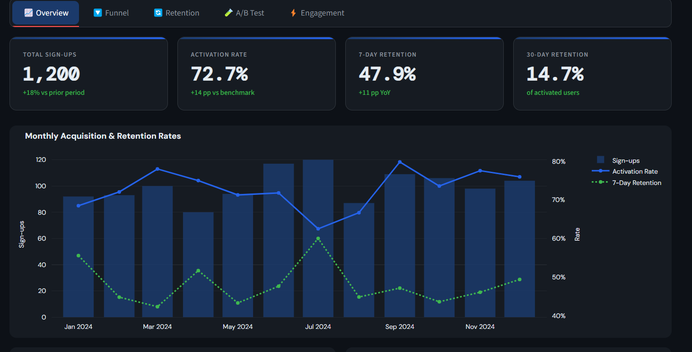
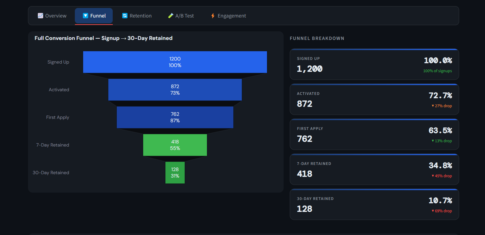

# LinkinReachly — Product Analytics Dashboard

**Portfolio Project** | Srinivasa Kommireddy | srinik27@outlook.com

A product analytics dashboard built as a demonstration project for the LinkinReachly / Sentari AI Data Analyst Intern role. Simulates the kind of analytics infrastructure a startup like LinkinReachly would need to make data-driven product decisions.

## 🔗 Live App
[**👉 Launch Dashboard**](https://appuctanalytics-vkv77mdg2djgr24d2wvuc7.streamlit.app/)

## 📊 What's Inside

| Tab | What it shows |
|-----|--------------|
| **Overview** | Headline KPIs, monthly acquisition trend, source breakdown, conversion by plan |
| **Funnel** | Full signup → activated → first apply → 7-day → 30-day retained funnel with drop-off analysis |
| **Retention** | Monthly cohort retention heatmap (12 cohorts × 5 stages) |
| **A/B Test** | Statistical significance analysis: AI Job Match onboarding vs Control, with z-test p-values |
| **Engagement** | Applies/session, message open rates, follow-up clicks — by source and plan |

## 🗃️ Dataset

Synthetic dataset of **1,200 simulated users** across Jan–Dec 2024.

Variables include: acquisition source, plan tier, A/B variant, activation, first apply, 7-day and 30-day retention, sessions/week, applies/session, AI apply %, message open rate, follow-up click rate.

## 📸 Screenshots

## 🧠 Key Analytical Decisions

- **Funnel design**: Modeled the 5 stages that matter most for a job application automation product: signup, activation (first search), first apply, 7-day retention, 30-day retention
- **A/B test**: Used two-proportion z-test with p < 0.05 significance threshold — Variant B (AI Job Match onboarding) shows statistically significant lift across all conversion metrics
- **Cohort retention**: Monthly cohorts allow seasonality analysis — Q1 and Q3 consistently outperform Q2
- **Source segmentation**: Referral users activate at highest rates, informing where to invest growth budget

## 💡 The One Question I'd Answer First

> *Which step in the application funnel has the highest drop-off — and is it a UX friction problem or a job-targeting problem?*

Based on this mock dataset: **Activation → First Apply** is the biggest drop. The A/B test results suggest that improving job-match quality at onboarding (not just UX) is the higher-leverage fix.

---

*Built with Python · Streamlit · Plotly · Pandas*
